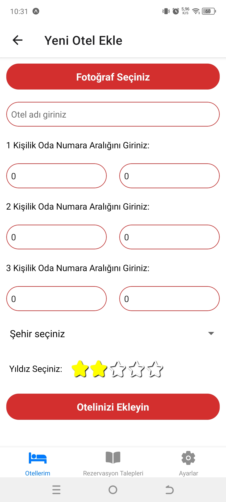
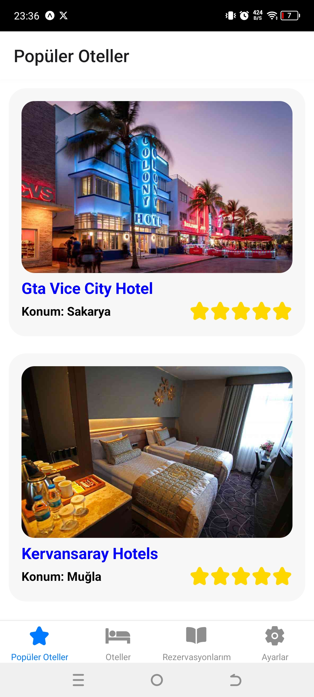

<h1 align="center">
  Otel Rezervasyon Uygulaması
</h1>

Bu otel rezervasyon uygulaması, müşterilerin otel rezervasyonları yapmalarını ve otel sahiplerinin kendi otellerini yönetmelerini sağlamak için tasarlanmıştır. Uygulama, iki ana kullanıcı türü olan "Müşteri" ve "Otel Sahibi" arasında geçiş yapabilen kullanıcı dostu bir arayüze sahiptir. Otel sahipleri, "Otellerim, Rezervasyon Talepleri, Otel Düzenleme, Otel Ekleme, Ayarlar" ekranlarına sahiptir. Müşteri kullanıcıları ise, "Popüler Oteler, Oteller, Rezervasyon Yap, Rezervasyonlarım, Ayarlar" ekranlarına sahiptir.

### Özellikler

##### Kullanıcı Hesapları:

Kullanıcılar, kişisel hesaplarını oluşturarak otel rezervasyonları yapabilirler.
Otel sahipleri, otellerini tanıtmak için özel hesaplarını oluşturabilirler.

##### Otel Yönetimi:

Otel sahipleri, kendi otellerini ekleyebilir, güncelleyebilir ve rezervasyon taleplerini yönetebilirler.
Rezervasyon taleplerini onayladıklarında, sistem otomatik olarak oda numarasını tanımlar.

##### Farklı Arayüzler:

Otel sahipleri için özel bir arayüz, otel bilgilerini yönetmelerine ve rezervasyon taleplerini görüntülemelerine olanak tanır.
Müşteri kullanıcıları ise otelleri listeler, rezervasyon talepleri oluşturur ve taleplerini takip eder.

##### Rezervasyon İşlemleri:

Müşteriler, istedikleri otellere rezervasyon talebi oluşturabilirler ve iptal edebilirler.
Otel sahipleri talepleri onayladığında, kullanıcılara otomatik olarak tanımlanan oda numarası gösterilir.

##### Güncelleme:

Otel sahipleri, otel bilgilerini güncelleyebilir veya var olan oteli silebilir.

## Tanıtım

- [Özellikler ve Kullanılmış Teknolojiler](#özellikler-ve-kullanılmış-teknolojiler)
- [Kullanım](#kullanım)
- [Katkı](#katkı)
- [Ekran Görüntüleri](#ekran-görüntüleri)
- [Lisans](#lisans)

## Özellikler ve Kullanılmış Teknolojiler

**1. UI Blocking:** Bir işlem gerçekleştiğinde, bir butona veya herhangi bir işlemin çalıştırılması engellenmiştir.

**2. Firebase:** Uygulamada yer alan otel, rezervasyon ve kullanıcı verileri için firebase kullanılmıştır.

**3. Authorization ve Authentication:** Kullanıcı giriş çıkış kontrol işlemleri ve yetkilendirme işlemleri gerçekleştirilmiştir.

**4. Local Notification:** Expo Notification ile kullanıcılara local bildirim gönderme işlemi gerçekleştirilmiştir.

**5. CRUD:** Veriler üzerinde CRUD işlemleri gerçekleştirilmiştir.

**6. Router:** React navigaation ile nested router geliştirilmiştir.

**7. UI:** React bileşenleri ve 3rd party kütüphaneler kullanıldı. Örneğin: flash-message, react-native-stars, image-picker, datetimepicker...
## Kullanım

React Native geliştirmek için gerekli araçlara ve ortama sahip olduğunuzdan emin olun.

### Yükleme

```bash
Bu repository'i `git clone https://github.com/mehmetalidemirtas/HotelBooking.git` ile klonlayın
'cd HotelBooking' ile proje dizinine gidin
```

### Kurulum

```bash
`npm install` komutu ile paketleri yükleyin
```

### Başlatma

```bash
`npm start` komutu ile Metro Bundler'ı başlatın
Emulatöre bağlanın ve `npx react-native run-android` komutunu çalıştırın
veya Expo Go uygulaması ile QR kodu taratarak uygulamayı kendi cihazınızda çalıştırın.
```

## Katkı

Katkılarınızı bekliyoruz! Herhangi bir öneriniz, hata raporunuz veya özellik isteğiniz varsa lütfen bir 'issue' açın veya bir 'pull request' gönderin.

## Ekran Görüntüleri

|                         |                         |                          |                         |
| ----------------------- | ----------------------- | ------------------------ | ----------------------- |
|   |   |    |   |
|   |   |  |   |
|   |   |    |  |
|  |  |   |  |
|  |  |                          |                         |

## Lisans

Bu proje [MIT License](LICENSE) kapsamında lisanslıdır.
